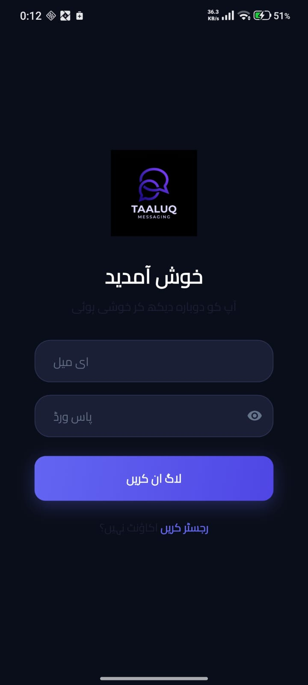
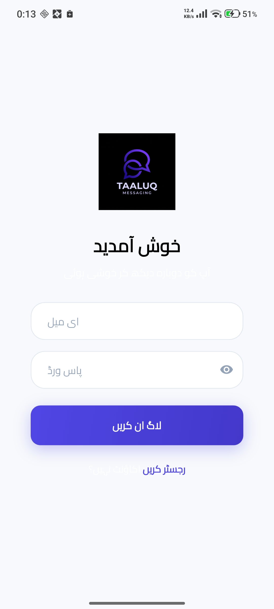
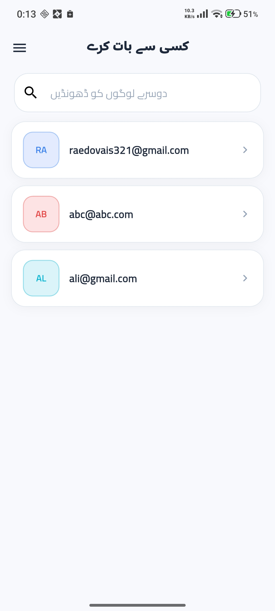
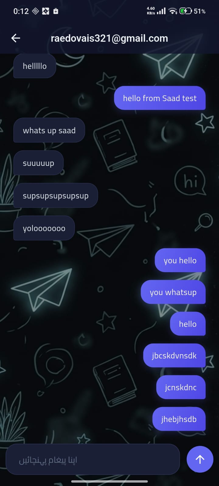
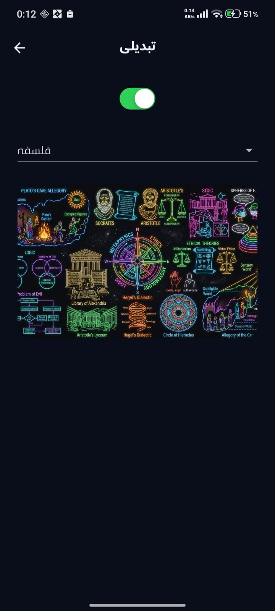
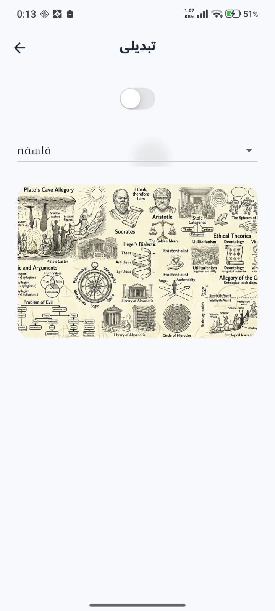
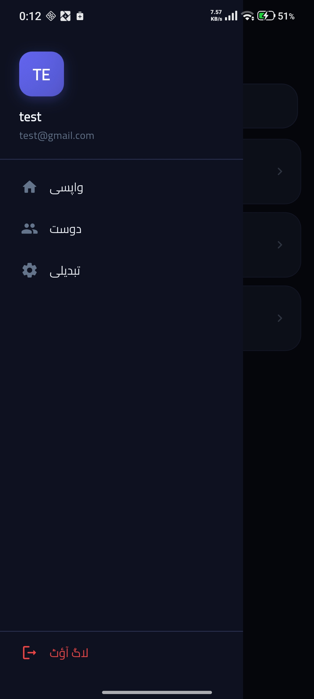
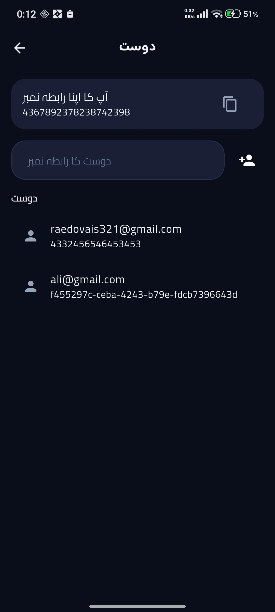

<div align="center">


# تعلق — Taaluq Messaging

**A real-time Urdu-first messaging app built with Flutter & Supabase**

[](https://taaluq.netlify.app/)
[](https://flutter.dev)
[](https://supabase.com)
[](LICENSE)

</div>

---

## 📱 Overview

**Taaluq** (تعلق — meaning *connection* in Urdu) is a full-stack real-time messaging application built with Flutter and Supabase. The app features a fully localised Urdu UI, end-to-end conversation flow, a contact-key friend system, and rich theming with subject-based chat wallpapers.

> 🌐 **Try it live:** [https://taaluq.netlify.app](https://taaluq.netlify.app)

---

## ✨ Features

| Feature | Description |
|---|---|
| 🔐 **Auth** | Email/password sign-up & login via Supabase Auth |
| 💬 **Real-time Messaging** | Live message delivery powered by Supabase Realtime |
| 👥 **Friend System** | Add contacts via unique contact keys — no phone number needed |
| 🌙 **Dark / Light Mode** | Full theme switching with animated backgrounds |
| 🎨 **Subject Wallpapers** | Chat backgrounds themed around Philosophy, Maths, Physics, Chemistry |
| 🌏 **Urdu UI** | Complete right-to-left Urdu interface throughout the app |
| 📱 **Cross-platform** | Runs on Android, iOS, Web, Linux, Windows, and macOS |

---

## 📸 Screenshots

<table>
  <tr>
    <td align="center"><b>Login (Dark)</b></td>
    <td align="center"><b>Login (Light)</b></td>
    <td align="center"><b>Home — Contacts</b></td>
  </tr>
  <tr>
    <td></td>
    <td></td>
    <td></td>
  </tr>
  <tr>
    <td align="center"><b>Chat (Dark)</b></td>
    <td align="center"><b>Chat (Philosophy Theme)</b></td>
    <td align="center"><b>Friends Page</b></td>
  </tr>
  <tr>
    <td></td>
    <td></td>
    <td></td>
  </tr>
  <tr>
    <td align="center"><b>Settings / Themes</b></td>
    <td align="center"><b>Side Drawer</b></td>
    <td align="center"><b>Search Users</b></td>
  </tr>
  <tr>
    <td></td>
    <td></td>
    <td></td>
  </tr>
</table>

---

## 🏗️ Architecture

```
taaluq/
├── lib/
│   ├── main.dart                   # App entry point — Supabase init, routing
│   ├── supabase_options.dart       # Supabase project URL & anon key
│   ├── global_variables.dart       # Shared global state
│   │
│   ├── Services/
│   │   ├── authentication/
│   │   │   ├── auth_gate.dart      # Login vs Home router
│   │   │   ├── auth_service.dart   # Sign-in / sign-up / sign-out
│   │   │   └── login_or_register.dart
│   │   └── chat/
│   │       └── chat_services.dart  # Send/receive messages, fetch conversations
│   │
│   ├── model/
│   │   └── message.dart            # Message data model
│   │
│   ├── pages/
│   │   ├── home_page.dart          # Conversations list
│   │   ├── chat_page.dart          # Messaging screen
│   │   ├── friends_page.dart       # Friends / contact-key management
│   │   ├── settings_page.dart      # Theme & wallpaper picker
│   │   ├── login_page.dart
│   │   └── register_page.dart
│   │
│   ├── components/                 # Reusable widget library
│   │   ├── chat_bubble.dart
│   │   ├── my_button.dart
│   │   ├── my_drawer.dart
│   │   ├── my_textfield.dart
│   │   └── user_tile.dart
│   │
│   └── themes/
│       ├── dark_mode.dart
│       ├── light_mode.dart
│       └── theme_provider.dart     # ChangeNotifier — drives live theme switching
│
└── assets/
    ├── logos/                      # Dark & light logo variants
    ├── background/                 # Animated GIF & static backgrounds
    ├── images_dark/                # Subject doodles — dark mode
    └── images_light/               # Subject doodles — light mode
```

---

## 🗄️ Database Schema

Hosted on **Supabase (PostgreSQL)** — region: `ap-northeast-1` (Tokyo).

### `public.users`

| Column | Type | Notes |
|---|---|---|
| `id` | `uuid` | Primary key, linked to `auth.users` |
| `email` | `text` | User's email address |
| `contact_key` | `text` | Unique numeric key used to add friends |

### `public.messages`

| Column | Type | Notes |
|---|---|---|
| `id` | `uuid` | Primary key |
| `sender_id` | `uuid` | FK → `auth.users` |
| `receiver_id` | `uuid` | FK → `auth.users` |
| `chat_room_id` | `text` | Deterministic room ID derived from both user IDs |
| `message` | `text` | Message content |

### `public.friends`

| Column | Type | Notes |
|---|---|---|
| `user1` | `text` | Contact key of user A |
| `user2` | `text` | Contact key of user B |

> ⚠️ **Note:** Row Level Security (RLS) is currently **disabled** on all tables. Enabling RLS policies is planned for the next release — see [Roadmap](#-roadmap).

---

## ⚡ Realtime

Supabase Realtime is enabled on the `messages` table via **Database Replication** (`ap-northeast-1`). The Flutter client subscribes to channel updates filtered by `chat_room_id`, delivering messages live without polling.

---

## 🔐 Authentication

Authentication is handled entirely by **Supabase Auth** using the **Email** provider. On successful sign-up:
1. A record is inserted into `public.users` with the user's email and a generated `contact_key`.
2. `AuthGate` listens to `onAuthStateChange` and routes to `HomePage` or `LoginPage` accordingly.


### Prerequisites

- Flutter SDK `>=3.0.0`
- A Supabase project ([supabase.com](https://supabase.com))

## 🛠️ Tech Stack

| Layer | Technology |
|---|---|
| **Framework** | Flutter 3.x (Dart) |
| **Backend / DB** | Supabase (PostgreSQL) |
| **Auth** | Supabase Auth — Email provider |
| **Realtime** | Supabase Realtime (WebSocket) |
| **State Management** | `ChangeNotifier` / `Provider` |
| **Hosting** | Netlify (web build) |
| **Notifications** | Firebase (configured) |

---

## 🗺️ Roadmap

- [ ] Enable Row Level Security (RLS) on `messages` and `users` tables
- [ ] Push notifications via Firebase Cloud Messaging
- [ ] Message read receipts (seen / delivered status)
- [ ] Profile pictures / avatars
- [ ] Group chats
- [ ] Message deletion and editing
- [ ] End-to-end encryption

---

## 📁 Assets

The app ships with animated and static backgrounds plus subject-specific doodle sets:

- **Backgrounds:** `black_bg.gif`, `light_bg.gif`, Urdu-typography overlays
- **Dark doodles:** Chemistry, Maths, Physics, Philosophy, Generic
- **Light doodles:** Chemistry, Math, Physics, Philosophy, Generic

> ⚠️ Minor naming inconsistency: dark mode uses `doodles_maths.png` while light mode uses `doodles_math.png`. This is noted for a future cleanup pass.

---

## 🤝 Contributing

Pull requests are welcome. For major changes, please open an issue first to discuss what you'd like to change.

1. Fork the repo
2. Create your feature branch (`git checkout -b feature/amazing-feature`)
3. Commit your changes (`git commit -m 'Add amazing feature'`)
4. Push to the branch (`git push origin feature/amazing-feature`)
5. Open a Pull Request

---

## 📄 License

Distributed under the MIT License. See `LICENSE` for more information.

---

<div align="center">

Made with ❤️ in Pakistan · Built with Flutter & Supabase

**[taaluq.netlify.app](https://taaluq.netlify.app)**

</div>
